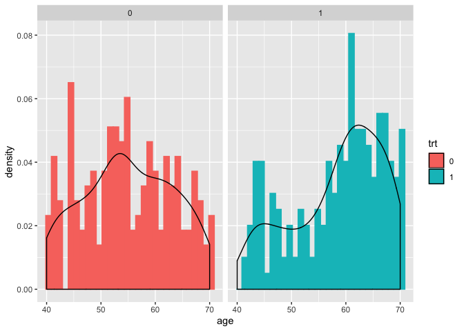
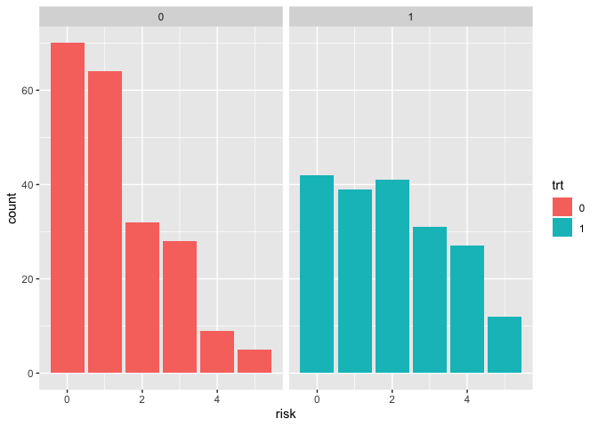
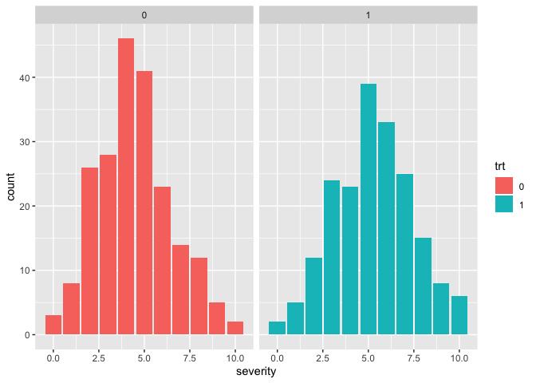

Propensity Score Analysis
================

We usually estimate treatment effect through randomized experiment where
there is a control group and a experimental group. However it is often
the case that treatments were not randomly assigned to
subjects.

## Data Exploring

``` r
data <- read.csv("http://web.hku.hk/~bcowling/data/propensity.csv", header=TRUE)
data$death = as.factor(data$death)
data$trt = as.factor(data$trt)
knitr::kable(head(data) ,format = "markdown")
```

| age | male | risk | severity | trt | death |
| --: | ---: | ---: | -------: | :-- | :---- |
|  48 |    1 |    3 |        8 | 0   | 0     |
|  59 |    1 |    4 |        6 | 1   | 0     |
|  67 |    1 |    3 |        6 | 0   | 1     |
|  51 |    1 |    0 |        6 | 0   | 0     |
|  56 |    1 |    1 |        6 | 1   | 0     |
|  60 |    1 |    1 |        6 | 0   | 0     |

### Check randomness

``` r
library(ggplot2)
ggplot(data, aes(x=age, y=..density..))  +
  geom_histogram(aes( fill=trt, color=trt), bins =30 ) +
  geom_density() +
  facet_grid(.~ trt)
```

<!-- --> From the plot above, we
observed that people in treatment group (trt = 1) were slightly older
than those in control group.

``` r
ggplot(data,aes(x=risk, fill=trt)) +  
  geom_bar(position = 'identity') +
  facet_grid(.~ trt)
```

<!-- -->

``` r
ggplot(data,aes(x=severity, fill=trt)) +
  geom_bar(position = 'identity') +
  facet_grid(.~ trt)
```

<!-- -->

Based on the plots above, it’s not hard to observe that the
distributions of few varaibles are not the same across two g
